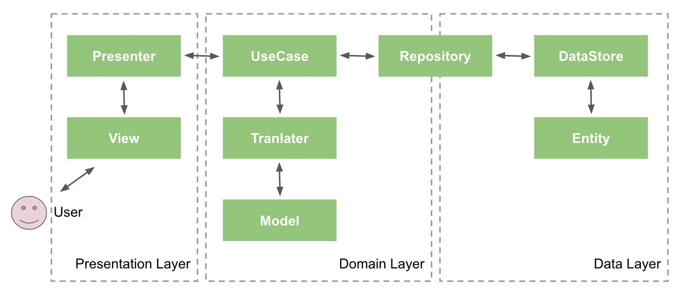

Clean Architecture
=============
애플리케이션을 구현할 때 상당히 많은 기능들이 들어가게 되면서 앱의 코드들이 복잡도가 증가하게 됩니다. 이후 유지보수를 하며 기능을 수정하거나 새로운 기능을 추가하면서 내부적으로 로직을 변경해야 하는 경우가 생기게된다면 복잡도가 높은 코드에서는 상당히 많은 공수가 들어가게 됩니다. 또한 복잡도가 높은 코드에서는 테스트를 진행하기도 힘들어집니다.

Clean Architecture는 기능의 계층을 분리하여 관심사를 분리하는 것을 목표로 프로젝트를 진행하게됩니다. 관심사가 분리되어 코드를 간결하게 작성하면 내부로직이 변경되어야 하는 시점에서 유연하게 대처할 수 있으며 코드에 대한 테스트를 진행하기에도 유용해집니다.

[by Robert C. Martin](http://blog.cleancoder.com/uncle-bob/2012/08/13/the-clean-architecture.html)

Clean Architecture는 크게 4가지 계층으로 이루어집니다. 계층들은 외부의 원들을 전혀 몰라야 한다는 의존성 규칙을 가지고 있습니다.

Entities
---------
엔티티는 비즈니스 규칙을 캡슐화합니다. 엔티티는 메서드를 갖는 객체일 수도 있지만 데이터 구조와 함수의 집합일 수도 있습니다.
기본적으로 비즈니스 규칙이 변화 하지않는다면 엔티티는 변경되지 않습니다.(DB, Http, Api 에서 데이터를 가져온 기본적인 데이터들이 들어있다)

>Entities encapsulate Enterprise wide business rules. An entity can be an object with methods, or it can be a set of data structures and functions. It doesn’t matter so long as the entities could be used by many different applications in the enterprise.

UseCase
---------
시스템의 모든 사용 사례를 캡슐화하고 구현합니다. UseCase 변경 사항이 Entities에 영향을 주면 안된다(의존성 규칙)
>The software in this layer contains application specific business rules. It encapsulates and implements all of the use cases of the system. These use cases orchestrate the flow of data to and from the entities, and direct those entities to use their enterprise wide business rules to achieve the goals of the use case.

Presenters
--------
Interface Adapters로도 불리며 외부와의 결합을 느슨하게하여 UseCase, Entites의 변경을 없애고 Use Case사용할 수 있도록 Adapter 코드들을 구현한다. DB, Http, Api의 구현을 전혀 알지 못한다.

Drivers
------
Framework, UI등의 의존성을 가지고 구현되어있다.

[Android Developer](https://developer.android.com/jetpack/guide)

Android Clean Architecture
-------

Android Clean Architecture에서는 3개의 계층으로 나누어 지게됩니다. 
Presentation -> Domain, Data -> Domain 방향으로 의존성을 갖고 있습니다.

Presenters layer
--------
UI코드가 들어있으며 User에게 Data를 보여주고 입력을 처리하는 layer입니다. Activity, Fragment, View, Presenter 및 ViewModel을 포함합니다.

Domain layer
-----
비즈니스 로직이 들어있는 핵심 계층으로 다른 계층으로부터 의존성을 가질수 없으며 순수 Java, Kotlin코드로만 구성하며 다른 애플리케이션에서도 사용할 수 있습니다. UseCase, Repository Interface를 가지고 있다.

Data layer
----
Domain layer의 의존성을 가지고 있으며 Repository를 상속받아 구현한다. DB, HTTP, API를 포함하고 있으며 Mapper 클래스를 가지고 Domain의 model로 데이터를 변환하는 작업을 한다.